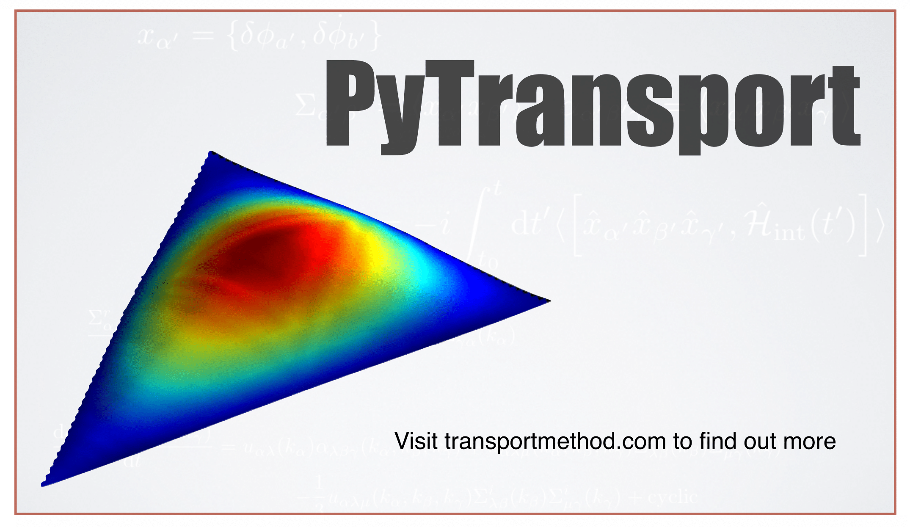

# Summary

PyTransport constitutes a straightforward code written in C++ together 
with Python scripts which automatically edit, compile and run the C++ code as a 
Python module. It has been written for Unix-like systems (OS X and Linux).
The transport method we utilise means 
only coupled differential equations need to be solved, and the implementation presented here 
combines the speed of C++ with the functionality and convenience of Python. 

The code is intended to be a reusable resource for inflationary cosmology. It enables users to quickly create a 
complied Python module(s) for any given model(s) of multi-field inflation. 
Primarily the module employs the transport approach to inflationary cosmology to calculate 
the tree-level power-spectrum and bispectrum of user specified models of multi-field inflation, 
accounting for all sub and super-horizon effects. To this end,
the module contains a number 
functions that can be called from Python and that perform tasks such as calculating the background evolution 
of the cosmology, as well as the evolution of the two and three point functions. We also provide a number of further functions written in 
Python that perform common tasks such as calculating the power spectrum or bispectrum over a range of scales by utilising the 
compiled module.
The true power of the approach, however, is that users can rapidly write their own scripts, or adapt ours, to suit their own needs. 

The transport approach to inflationary perturbation theory that the code employs 
can be seen as the differential version of the integral expressions of the In-In formalism. It 
is helpful numerically because it provides a set of ordinary differential equations for the correlation functions  
of inflationary perturbations. The code solves these equations from deep inside the horizon until some desired time 
after horizon crossing using a standard variable step size ordinary differential equation (ODE) 
routine with error control. Such off the shelf 
routines are extremely well tested, and provide
an easy way to change the required accuracy. This is helpful in order to check convergence of the numerical 
solutions, or to respond to needs of models with very fine features. 
Details of the transport method itself that the code is based on can be found in the recent paper [@xxx][@xxx1}. We 
highly recommend reading this guide in combination with that paper.

# References
